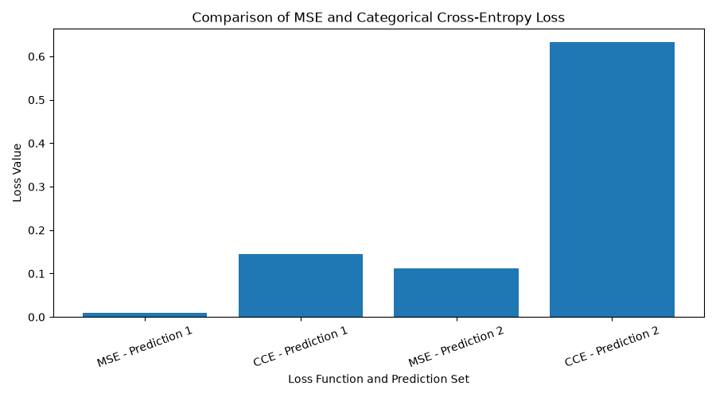
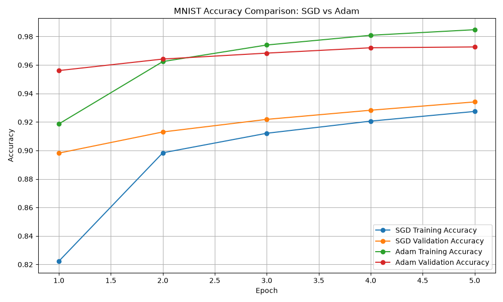

# CS5720 Neural Network & Deep Learning
## Home Assignment 1

**Student Name:** Moulika Reddy  
**Course:** CS5720 - Neural Network & Deep Learning  
**Semester:** Fall 2026  
**University:** University of Central Missouri  

---

## Assignment Overview

This repository contains the programming tasks completed for Home Assignment 1
in CS5720 Neural Network & Deep Learning.

The assignment demonstrates basic TensorFlow operations, loss functions,
MNIST classification using different optimizers, and model visualization
using TensorBoard.

---

## Task 1 - Tensor Manipulations and Reshaping

In this task, I created a random TensorFlow tensor with shape `(4, 6)` and
used TensorFlow functions to determine its rank and shape.

The tensor was reshaped from `(4, 6)` to `(2, 3, 4)` and then transposed
to `(3, 2, 4)`.

A smaller tensor with shape `(1, 4)` was also created and added to the
larger tensor using TensorFlow broadcasting.

### Broadcasting

Broadcasting allows TensorFlow to perform operations between tensors with
different but compatible shapes. TensorFlow automatically expands the
smaller tensor across the required dimensions without manually copying
its values.

### Results

- Original tensor shape: `(4, 6)`
- Original tensor rank: `2`
- Reshaped tensor shape: `(2, 3, 4)`
- Reshaped tensor rank: `3`
- Transposed tensor shape: `(3, 2, 4)`
- Small tensor shape: `(1, 4)`
- Final tensor shape after broadcasting: `(3, 2, 4)`

### Source Code

`task1_tensor_operations.py`

---

## Task 2 - Loss Functions

In this task, I compared Mean Squared Error (MSE) and Categorical
Cross-Entropy (CCE) using two sets of predictions.

Prediction Set 1 contained predictions that were closer to the true
labels, while Prediction Set 2 contained less accurate predictions.

### Results

| Loss Function | Prediction Set 1 | Prediction Set 2 |
|---|---:|---:|
| MSE | 0.0100 | 0.1111 |
| Categorical Cross-Entropy | 0.1446 | 0.6324 |

Both loss values increased when the predictions became less accurate.
This demonstrates that loss functions measure the difference between
the true values and the model's predictions.

### Loss Comparison



### Source Code

`task2_loss_functions.py`

---

## Task 3 - MNIST Classification: SGD vs Adam

In this task, I trained two neural networks on the MNIST handwritten
digit dataset.

Both models used the same neural network architecture, but different
optimizers were used:

- Model 1: SGD
- Model 2: Adam

Using the same architecture allowed me to compare the effect of the
optimizer on model training.

### Results

After training for five epochs:

| Optimizer | Test Accuracy |
|---|---:|
| SGD | 93.37% |
| Adam | 97.24% |

In this experiment, Adam learned faster and achieved higher training,
validation, and test accuracy than SGD.

### Accuracy Comparison



### Source Code

`task3_mnist_optimizers.py`

---

## Task 4 - MNIST with TensorBoard

In this task, I trained a simple neural network on the MNIST dataset
for five epochs and used TensorBoard to monitor the training process.

TensorBoard logs were stored in:

`logs/fit/`

TensorBoard was used to visualize training and validation accuracy
and loss.

### Results

At the end of five epochs:

- Training Accuracy: approximately **98.50%**
- Validation Accuracy: approximately **97.47%**
- Test Accuracy: approximately **97.70%**
- Training Loss: approximately **0.0502**
- Validation Loss: approximately **0.0853**

Both training and validation accuracy increased during training.
Training and validation loss also decreased.

### Task 4 Questions

**1. What patterns do you observe in training and validation accuracy?**

Both training and validation accuracy increased as the number of epochs
increased. At the end of five epochs, training accuracy was approximately
98.50% and validation accuracy was approximately 97.47%. The two values
remained relatively close, indicating that the model was learning well
and generalizing reasonably well to the validation data.

**2. How can TensorBoard help detect overfitting?**

TensorBoard can help detect overfitting by comparing training and
validation curves. If training accuracy continues to increase while
validation accuracy stops improving or decreases, the model may be
overfitting. Similarly, if training loss continues to decrease while
validation loss starts increasing, this can also indicate overfitting.

**3. What happens if the number of epochs is increased?**

Increasing the number of epochs gives the model more opportunities to
learn from the training data, so training accuracy may increase and
training loss may decrease. However, training for too many epochs can
cause overfitting. In that case, validation performance may stop
improving or become worse.

### Source Code

`task4_tensorboard.py`

---

## Technologies Used

- Python
- TensorFlow
- Keras
- Matplotlib
- TensorBoard
- Visual Studio Code
- Git
- GitHub

---

## How to Run the Programs

Activate the Python environment and run each task using:

```bash
python task1_tensor_operations.py
python task2_loss_functions.py
python task3_mnist_optimizers.py
python task4_tensorboard.py
```

To launch TensorBoard after running Task 4:

```bash
tensorboard --logdir logs/fit
```

Then open TensorBoard in a web browser at `localhost:6006`.

---

## Repository Structure

```text
CS5720-Home-Assignment-1/
├── README.md
├── task1_tensor_operations.py
├── task2_loss_functions.py
├── task3_mnist_optimizers.py
├── task4_tensorboard.py
├── loss_comparison.png
├── optimizer_comparison.png
├── logs/
│   └── fit/
└── .gitignore
```